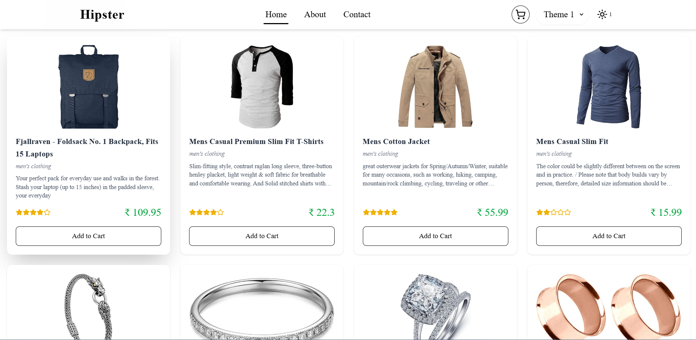
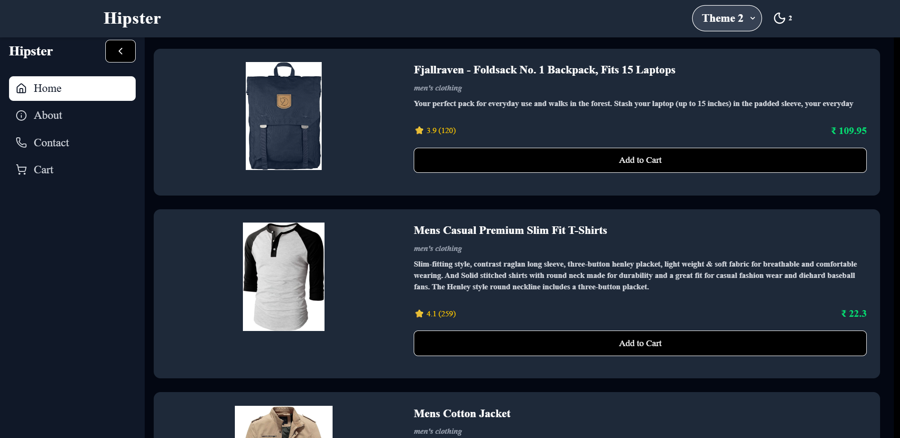
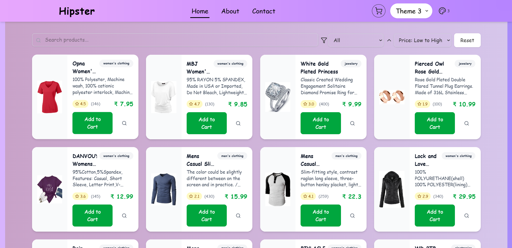

# Multi-Theme Switcher App  

A React-based web application that allows users to switch between three distinct themes with noticeable differences in layout, colors, fonts, and structure. The application also fetches product data from an API and demonstrates theme persistence across multiple pages.  

##  Live Demo  
[Live App Link](https://priyanshu-mehta-react-frontend-asse.vercel.app/)  

##  Repository  
[GitHub Repository Link](https://github.com/priyanshumehta10/PriyanshuMehta-ReactFrontendAssessment)  

---

##  Features  
- **Three Unique Themes**  
  - **Theme 1:** Minimalist light mode with sans-serif font.  
  - **Theme 2:** Dark mode with sidebar layout and bold serif font.  
  - **Theme 3:** Colorful card-based grid layout with playful Google Font `Pacifico`.  
- **Theme Persistence** – Uses `localStorage` to remember the selected theme across reloads.  
- **Dynamic Data** – Fetches products from [FakeStore API](https://fakestoreapi.com/products).  
- **Add to Cart Functionality** –  
  - Users can add products to a shopping cart.  
  - Cart data is stored in `localStorage` for persistence across page reloads.  
  - Users can remove items and clear the cart.  
  - Cart updates are reflected instantly in the UI.  
- **Multi-Page Support** – Includes Home, About, Contact and Cart pages using `React Router`.  
- **Responsive Design** – Works on desktop, tablet, and mobile devices.  
- **Animations** – Smooth theme switching transitions.  
- **TypeScript Support** – Strongly typed code for better maintainability.  

---

##  Tech Stack  
- **Frontend:** React, TypeScript  
- **State Management:** Context API  
- **Styling:** Tailwind CSS  
- **Routing:** React Router  
- **Data Fetching:** Fetch API (from FakeStore API)  
- **Deployment:** Vercel  

---

##  Installation & Setup  

1. **Clone the Repository**  
   ```bash
   git clone https://github.com/priyanshumehta10/PriyanshuMehta-ReactFrontendAssessment
   cd multi-theme-switcher

2. npm install

3. npm run dev

4. npm run build

##  Screenshots  

###  Theme 1 – Minimalist Light Mode  
  

###  Theme 2 – Dark Mode with Sidebar  
  

###  Theme 3 – Colorful Grid Layout  
  


##  Auther
Priyanshu Mehta
 mehtapriyanshu@gmail.com
 +91 7618372810